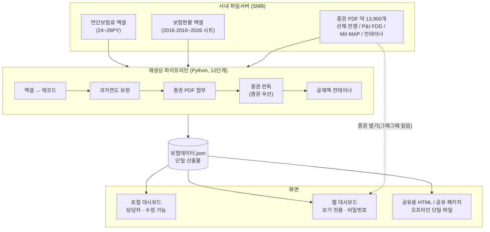

# 아키텍처 개요

## 전체 그림



**DB가 없습니다.** 데이터는 `보험데이터.json` 한 개이고, 모든 스크립트가 이 파일을 읽고 씁니다.

## 세 갈래 화면, 하나의 표 코드

| 화면 | 템플릿 | 수정 | 쓰임 |
|---|---|---|---|
| 로컬 대시보드 | `templates/index.html` | **O** | 담당자 PC. 유일하게 수정·재생성·내보내기 가능 |
| 공유용 단일 HTML | `templates/share.html` | X | 데이터 내장, 파일 하나. 증권 열기 없음 |
| 웹 대시보드 · 공유 패키지 | `templates/package.html` | X | **웹앱이 이 파일을 렌더** |

!!! danger "표·차트 수정은 3개 파일 모두에"
    세 파일은 표·차트 렌더링 코드가 거의 같습니다. 한 곳만 고치면 나머지 두 화면이 조용히 달라집니다.

## 저장소 추상화

웹앱은 저장소를 **어댑터**로 봅니다. 실제로 쓰는 것은 두 가지뿐입니다.

```python
bucket().download_file_by_name(name).save(buf)
bucket().upload_bytes(body, name)
```

환경변수로 **사내 NAS(SMB)** 와 **외부 오브젝트 스토리지**(이전 방식) 중 하나가 선택됩니다.
사내 이전이 끝난 뒤에도 예전 게시 경로를 남겨 두려고 둘 다 유지합니다.

!!! info "증권 PDF는 서버에 복사하지 않습니다"
    요청이 올 때마다 사내 저장소에서 읽어 흘려보냅니다. **증권·보험료는 대외비**라 사외 저장을 하지 않습니다.

## 저장소에 올라가는 것

```
<저장소 루트>
├── 보험데이터.json      ← 이것만 있어도 표는 뜬다 (필수)
├── certs/               ← 증권 PDF. 원본 폴더 구조를 그대로 유지
├── remarks.json         ← 비고. 없으면 첫 저장 때 자동 생성
└── vessel.txt           ← 선박 코드표 (선박 조회 탭을 쓸 때만)
```

증권 링크는 레코드의 상대경로를 그대로 이어 붙여 만듭니다.

```
브라우저: /original?rel=선체, 전쟁 보험 증권/2024 PY/…/파일.pdf
   서버 : "certs/" + rel  →  저장소 경로
```

!!! note "윈도우에서 만든 데이터를 리눅스 서버가 읽습니다"
    레코드의 상대경로는 윈도우식 역슬래시(`\`)로 저장됩니다. 서버는 내려보낼 때 `/` 로 바꾸고,
    저장소 어댑터가 다시 `\` 로 되돌립니다. 양쪽에서 같은 데이터가 그대로 동작합니다.

## 비고(remark)를 따로 두는 이유

재생성이 `보험데이터.json` 을 **매번 새로 만들기 때문에**, 거기에 메모를 넣으면 재생성할 때마다 전부 날아갑니다. 그래서 별도 파일에 두고 화면에 낼 때 합칩니다.

키로 `id` 를 쓰지 않습니다 — 재생성 때 1번부터 다시 매겨져 다른 줄을 가리키게 됩니다.
업무상 의미가 바뀌지 않는 값으로 키를 만듭니다.

```
선명 | 보험종류 | 보험연도 | 보험자 | 계열사
```

## 사내 시스템 연동 (선택)

선박·B/L·컨테이너 조회 탭은 사내 운항시스템 API를 씁니다.
**API 키 환경변수가 있을 때만** 붙으며, 없으면 blueprint 자체를 등록하지 않아 관련 경로가 존재하지 않습니다.
보험 데이터와는 독립적이고, 선박명으로 **보험자 교차조회**만 대시보드 데이터를 참조합니다.
