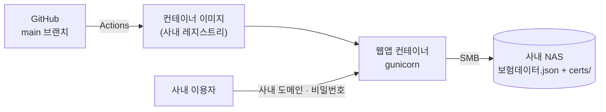

# 배포 개요

!!! note "이 문서의 범위"
    구성 방식과 원칙만 다룹니다. 리소스명·네트워크 대역·계정·시크릿 값은 **사내 문서**에 있습니다.

## 구성

- 이미지는 `python:3.12-slim` 기반, 비루트 사용자로 실행합니다.
- gunicorn **워커 2 × 스레드 4**. 저장소 응답을 기다리는 동안 다른 요청을 받게 합니다.
- 타임아웃을 넉넉히 둡니다 — 큰 증권은 저장소 왕복이 기본값을 넘습니다.
- **증권 PDF는 이미지에 넣지 않습니다.** 요청 때마다 사내 저장소에서 읽어 흘려보냅니다.

## 자동 배포

`main` 에 머지되면 GitHub Actions가 이미지를 빌드·푸시하고 새 리비전으로 교체한 뒤,
헬스체크로 응답을 확인합니다. 실패하면 워크플로가 실패로 끝납니다.

## 환경변수

| 목적 | 개수 | 비고 |
|---|---|---|
| 사내 NAS 접속 | 4 | 비밀번호는 시크릿 |
| 공유 비밀번호 | 1 | 시크릿 |
| 세션 서명키 | 1 | 시크릿 |
| 사내 시스템 API 키 | 1 | 있으면 조회 탭이 켜진다 |

!!! warning "이 값들은 담당자 PC의 설정 파일에 없습니다"
    운영 컨테이너에만 있는 **배포 설정**입니다. 코드 리포에서 찾지 마세요.

## 저장소가 두 갈래인 이유

환경변수 유무로 **사내 NAS(SMB)** 또는 **외부 오브젝트 스토리지**를 씁니다.
사내 이전이 끝난 뒤에도 담당자 PC의 기존 게시 경로를 지우지 않으려고 둘 다 남겨 두었습니다.

| 실행 위치 | 읽는 곳 |
|---|---|
| 운영 | 사내 NAS — 증권이 사외로 나가지 않는다 |
| 담당자 PC · 이전 방식 | 외부 오브젝트 스토리지 |

## 저장소를 못 읽을 때

500 대신 **안내 화면(503)** 을 보여줍니다. 이 화면을 보는 사람은 보험팀 실무자이므로
무슨 일이고 누구에게 말해야 하는지 적습니다. 기술적 원인은 **서버 로그에만** 남깁니다
(증권 경로가 화면에 나가지 않게).

- 데이터 파일이 아직 없음 → "보험팀에서 올리면 자동으로 표시됩니다"
- 그 밖의 오류 → "잠시 후 다시 시도, 계속되면 전산팀에 알려 주세요"

## 보안 원칙

- **증권 PDF·보험료는 대외비.** 실데이터와 설정 파일은 코드 리포에 올리지 않습니다.
- 웹은 **비밀번호 로그인 필수, 보기 전용**입니다.
- 공유용 HTML에는 키가 들어가지 않지만 실데이터가 담기므로 **사내에서만** 공유합니다.
- 스캔 증권 이미지 판독은 증권을 외부 API로 보내므로 **담당자 승인**이 필요하고, 자동 파이프라인에 넣지 않았습니다.
- 사내 시스템 연동 응답은 **허용 목록**으로 걸러 내보냅니다.
